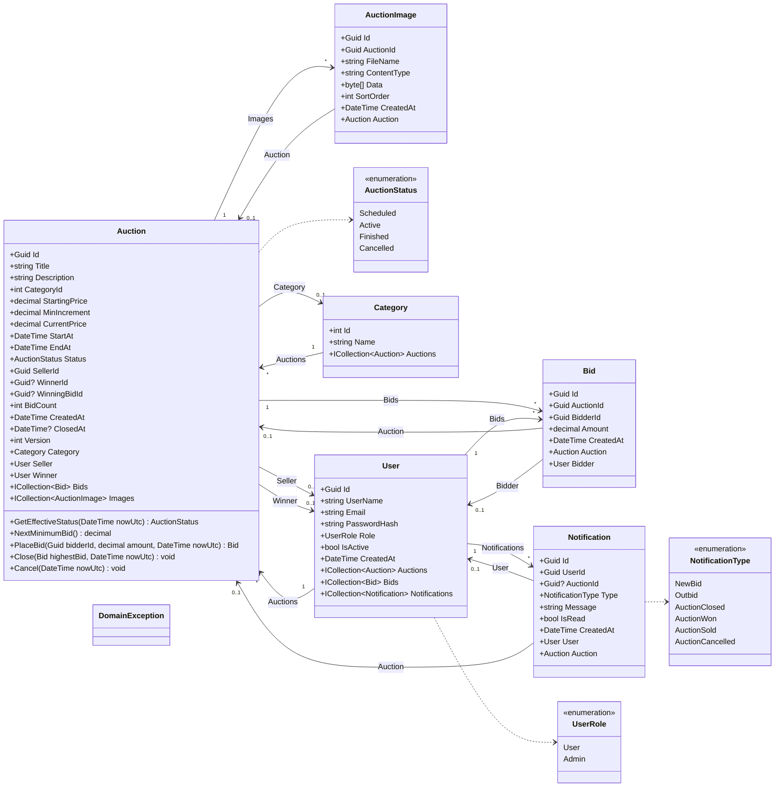

# Diagrama de clases

> Generado por reflexión a partir del ensamblado Subasta.Api (dominio, servicios, controladores y hub).
>
> Documento generado automáticamente por `generase-documentation.yml` (Subasta.DocGen) el 2026-10-03 02:26 UTC. No editar manualmente.

## 1. Modelo de dominio

## 2. Capa de aplicación (controladores, servicios, hub y persistencia)

```mermaid
classDiagram
    direction TB
    class AdminService {
        +GetStatsAsync(CancellationToken ct) Task~AdminStatsDto~
        +GetUsersAsync(string search, CancellationToken ct) Task~IReadOnlyList~UserDto~~
        +UpdateUserAsync(Guid currentAdminId, Guid userId, UpdateUserRequest request, CancellationToken ct) Task~UserDto~
    }
    class AuctionClosingBackgroundService {
    }
    class AuctionLifecycleService {
        +ProcessDueAuctionsAsync(CancellationToken ct) Task~int~
        +CloseAsync(Guid auctionId, CancellationToken ct) Task
    }
    class AuctionService {
        +CreateAsync(Guid sellerId, CreateAuctionRequest request, CancellationToken ct) Task~AuctionDetailDto~
        +SearchAsync(AuctionQuery query, CancellationToken ct) Task~PagedResult~AuctionSummaryDto~~
        +GetAsync(Guid id, CancellationToken ct) Task~AuctionDetailDto~
        +AddImageAsync(Guid auctionId, Guid userId, IFormFile file, CancellationToken ct) Task~string~
        +GetImageAsync(Guid auctionId, Guid imageId, CancellationToken ct) Task~AuctionImage~
        +CancelAsync(Guid auctionId, Guid userId, bool isAdmin, CancellationToken ct) Task
        +GetUserAuctionsAsync(Guid userId, string type, CancellationToken ct) Task~IReadOnlyList~AuctionSummaryDto~~
        +GetCategoriesAsync(CancellationToken ct) Task~IReadOnlyList~CategoryDto~~
    }
    class AuthService {
        +RegisterAsync(RegisterRequest request, CancellationToken ct) Task~AuthResponse~
        +LoginAsync(LoginRequest request, CancellationToken ct) Task~AuthResponse~
        +CreateToken(User user, DateTime expiresAt) string
    }
    class BidService {
        +PlaceBidAsync(Guid bidderId, PlaceBidRequest request, CancellationToken ct) Task~BidDto~
        +GetAuctionBidsAsync(Guid auctionId, CancellationToken ct) Task~IReadOnlyList~BidDto~~
        +GetUserBidsAsync(Guid userId, CancellationToken ct) Task~IReadOnlyList~UserBidDto~~
    }
    class IAdminService {
        <<interface>>
        +GetStatsAsync(CancellationToken ct) Task~AdminStatsDto~
        +GetUsersAsync(string search, CancellationToken ct) Task~IReadOnlyList~UserDto~~
        +UpdateUserAsync(Guid currentAdminId, Guid userId, UpdateUserRequest request, CancellationToken ct) Task~UserDto~
    }
    class IAuctionLifecycleService {
        <<interface>>
        +ProcessDueAuctionsAsync(CancellationToken ct) Task~int~
        +CloseAsync(Guid auctionId, CancellationToken ct) Task
    }
    class IAuctionService {
        <<interface>>
        +CreateAsync(Guid sellerId, CreateAuctionRequest request, CancellationToken ct) Task~AuctionDetailDto~
        +SearchAsync(AuctionQuery query, CancellationToken ct) Task~PagedResult~AuctionSummaryDto~~
        +GetAsync(Guid id, CancellationToken ct) Task~AuctionDetailDto~
        +AddImageAsync(Guid auctionId, Guid userId, IFormFile file, CancellationToken ct) Task~string~
        +GetImageAsync(Guid auctionId, Guid imageId, CancellationToken ct) Task~AuctionImage~
        +CancelAsync(Guid auctionId, Guid userId, bool isAdmin, CancellationToken ct) Task
        +GetUserAuctionsAsync(Guid userId, string type, CancellationToken ct) Task~IReadOnlyList~AuctionSummaryDto~~
        +GetCategoriesAsync(CancellationToken ct) Task~IReadOnlyList~CategoryDto~~
    }
    class IAuthService {
        <<interface>>
        +RegisterAsync(RegisterRequest request, CancellationToken ct) Task~AuthResponse~
        +LoginAsync(LoginRequest request, CancellationToken ct) Task~AuthResponse~
        +CreateToken(User user, DateTime expiresAt) string
    }
    class IBidService {
        <<interface>>
        +PlaceBidAsync(Guid bidderId, PlaceBidRequest request, CancellationToken ct) Task~BidDto~
        +GetAuctionBidsAsync(Guid auctionId, CancellationToken ct) Task~IReadOnlyList~BidDto~~
        +GetUserBidsAsync(Guid userId, CancellationToken ct) Task~IReadOnlyList~UserBidDto~~
    }
    class INotificationService {
        <<interface>>
        +Enqueue(Guid userId, NotificationType type, string message, Guid? auctionId) Notification
        +PublishAsync(IEnumerable~Notification~ notifications, CancellationToken ct) Task
        +GetForUserAsync(Guid userId, bool unreadOnly, CancellationToken ct) Task~IReadOnlyList~NotificationDto~~
        +CountUnreadAsync(Guid userId, CancellationToken ct) Task~int~
        +MarkAsReadAsync(Guid userId, Guid notificationId, CancellationToken ct) Task
        +MarkAllAsReadAsync(Guid userId, CancellationToken ct) Task
    }
    class NotificationService {
        +Enqueue(Guid userId, NotificationType type, string message, Guid? auctionId) Notification
        +PublishAsync(IEnumerable~Notification~ notifications, CancellationToken ct) Task
        +GetForUserAsync(Guid userId, bool unreadOnly, CancellationToken ct) Task~IReadOnlyList~NotificationDto~~
        +CountUnreadAsync(Guid userId, CancellationToken ct) Task~int~
        +MarkAsReadAsync(Guid userId, Guid notificationId, CancellationToken ct) Task
        +MarkAllAsReadAsync(Guid userId, CancellationToken ct) Task
    }
    class AdminController {
        +Stats(CancellationToken ct) Task~ActionResult~AdminStatsDto~~
        +Users(string search, CancellationToken ct) Task~ActionResult~IReadOnlyList~UserDto~~~
        +UpdateUser(Guid id, UpdateUserRequest request, CancellationToken ct) Task~ActionResult~UserDto~~
        +Auctions(AuctionQuery query, CancellationToken ct) Task~ActionResult~PagedResult~AuctionSummaryDto~~~
        +Close(Guid id, CancellationToken ct) Task~IActionResult~
        +Cancel(Guid id, CancellationToken ct) Task~IActionResult~
    }
    class AuctionsController {
        +Create(CreateAuctionRequest request, CancellationToken ct) Task~ActionResult~AuctionDetailDto~~
        +List(AuctionQuery query, CancellationToken ct) Task~ActionResult~PagedResult~AuctionSummaryDto~~~
        +GetById(Guid id, CancellationToken ct) Task~ActionResult~AuctionDetailDto~~
        +UploadImage(Guid id, IFormFile file, CancellationToken ct) Task~ActionResult~object~~
        +GetImage(Guid id, Guid imageId, CancellationToken ct) Task~IActionResult~
        +Cancel(Guid id, CancellationToken ct) Task~IActionResult~
        +Categories(CancellationToken ct) Task~ActionResult~IReadOnlyList~CategoryDto~~~
    }
    class AuthController {
        +Register(RegisterRequest request, CancellationToken ct) Task~ActionResult~AuthResponse~~
        +Login(LoginRequest request, CancellationToken ct) Task~ActionResult~AuthResponse~~
        +Me(CancellationToken ct) Task~ActionResult~UserDto~~
    }
    class BidsController {
        +Place(PlaceBidRequest request, CancellationToken ct) Task~ActionResult~BidDto~~
        +ByAuction(Guid auctionId, CancellationToken ct) Task~ActionResult~IReadOnlyList~BidDto~~~
    }
    class UserController {
        +Auctions(string type, CancellationToken ct) Task~ActionResult~IReadOnlyList~AuctionSummaryDto~~~
        +Bids(CancellationToken ct) Task~ActionResult~IReadOnlyList~UserBidDto~~~
        +Notifications(bool unreadOnly, CancellationToken ct) Task~ActionResult~IReadOnlyList~NotificationDto~~~
        +UnreadCount(CancellationToken ct) Task~ActionResult~object~~
        +MarkRead(Guid id, CancellationToken ct) Task~IActionResult~
        +MarkAllRead(CancellationToken ct) Task~IActionResult~
    }
    class AuctionHub {
        +AuctionGroup(Guid auctionId) string$
        +UserGroup(Guid userId) string$
        +OnConnectedAsync() Task
        +JoinAuction(Guid auctionId) Task
        +LeaveAuction(Guid auctionId) Task
    }
    class AppDbContext {
        +DbSet~User~ Users
        +DbSet~Category~ Categories
        +DbSet~Auction~ Auctions
        +DbSet~AuctionImage~ AuctionImages
        +DbSet~Bid~ Bids
        +DbSet~Notification~ Notifications
    }
    IAdminService <|.. AdminService
    AdminService ..> AppDbContext : usa
    IAuctionLifecycleService <|.. AuctionLifecycleService
    AuctionLifecycleService ..> AppDbContext : usa
    AuctionLifecycleService ..> INotificationService : usa
    IAuctionService <|.. AuctionService
    AuctionService ..> AppDbContext : usa
    AuctionService ..> INotificationService : usa
    IAuthService <|.. AuthService
    AuthService ..> AppDbContext : usa
    IBidService <|.. BidService
    BidService ..> AppDbContext : usa
    BidService ..> INotificationService : usa
    INotificationService <|.. NotificationService
    NotificationService ..> AppDbContext : usa
    ControllerBase <|-- AdminController
    AdminController ..> IAdminService : usa
    AdminController ..> IAuctionService : usa
    AdminController ..> IAuctionLifecycleService : usa
    ControllerBase <|-- AuctionsController
    AuctionsController ..> IAuctionService : usa
    ControllerBase <|-- AuthController
    AuthController ..> IAuthService : usa
    AuthController ..> AppDbContext : usa
    ControllerBase <|-- BidsController
    BidsController ..> IBidService : usa
    ControllerBase <|-- UserController
    UserController ..> IAuctionService : usa
    UserController ..> IBidService : usa
    UserController ..> INotificationService : usa
    Hub <|-- AuctionHub
```

