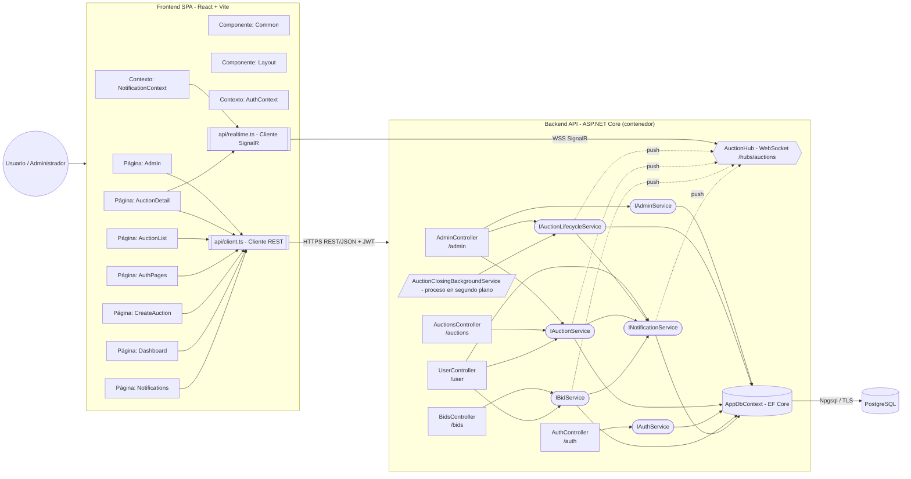

# Diagrama de componentes

> Componentes del frontend (React), de la API (.NET) y de la persistencia, con sus dependencias.
>
> Documento generado automáticamente por `generase-documentation.yml` (Subasta.DocGen) el 2026-10-03 02:32 UTC. No editar manualmente.

## Endpoints expuestos

| Método | Ruta | Controlador | Acción | Autorización |
|---|---|---|---|---|
| GET | `/admin/stats` | AdminController | Stats | JWT (Admin) |
| GET | `/admin/users` | AdminController | Users | JWT (Admin) |
| PATCH | `/admin/users/{id:guid}` | AdminController | UpdateUser | JWT (Admin) |
| GET | `/admin/auctions` | AdminController | Auctions | JWT (Admin) |
| POST | `/admin/auctions/{id:guid}/close` | AdminController | Close | JWT (Admin) |
| POST | `/admin/auctions/{id:guid}/cancel` | AdminController | Cancel | JWT (Admin) |
| POST | `/auctions` | AuctionsController | Create | JWT |
| GET | `/auctions` | AuctionsController | List | Pública |
| GET | `/auctions/{id:guid}` | AuctionsController | GetById | Pública |
| POST | `/auctions/{id:guid}/images` | AuctionsController | UploadImage | JWT |
| GET | `/auctions/{id:guid}/images/{imageId:guid}` | AuctionsController | GetImage | Pública |
| POST | `/auctions/{id:guid}/cancel` | AuctionsController | Cancel | JWT |
| GET | `/categories` | AuctionsController | Categories | Pública |
| POST | `/auth/register` | AuthController | Register | Pública |
| POST | `/auth/login` | AuthController | Login | Pública |
| GET | `/auth/me` | AuthController | Me | JWT |
| POST | `/bids` | BidsController | Place | JWT |
| GET | `/bids` | BidsController | ByAuction | Pública |
| GET | `/user/auctions` | UserController | Auctions | JWT |
| GET | `/user/bids` | UserController | Bids | JWT |
| GET | `/user/notifications` | UserController | Notifications | JWT |
| GET | `/user/notifications/unread-count` | UserController | UnreadCount | JWT |
| POST | `/user/notifications/{id:guid}/read` | UserController | MarkRead | JWT |
| POST | `/user/notifications/read-all` | UserController | MarkAllRead | JWT |
| WS | `/hubs/auctions` | AuctionHub | JoinAuction / LeaveAuction | Opcional (JWT) |

**Eventos en tiempo real (servidor → cliente):** `BidPlaced`, `AuctionClosed`, `AuctionStarted`, `AuctionCancelled`, `Notification`.
