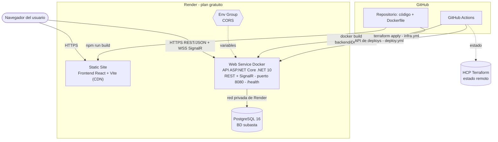
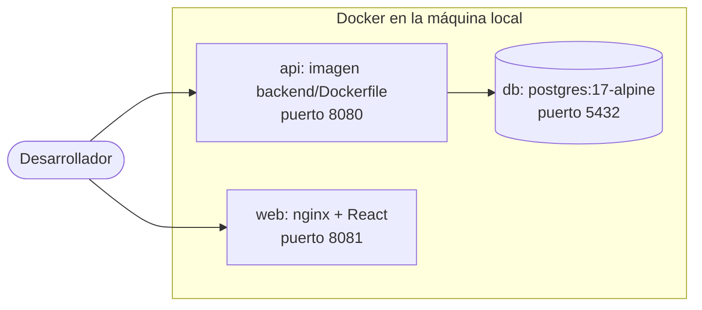
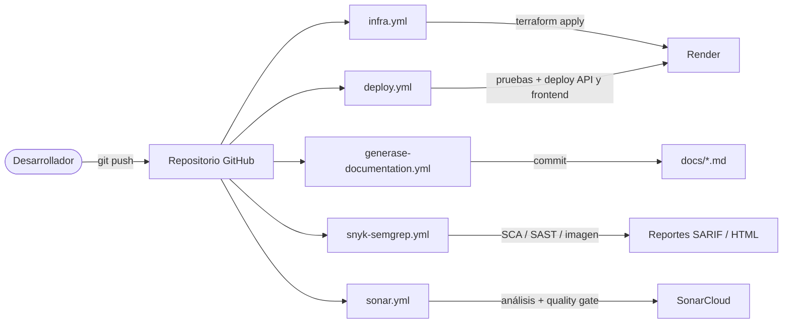

# Diagramas de despliegue

> Construido a partir de 7 recursos Terraform en `infra/`, `docker-compose.yml` y 5 workflows de GitHub Actions.
>
> Documento generado automáticamente por `generase-documentation.yml` (Subasta.DocGen) el 2026-10-03 02:26 UTC. No editar manualmente.

## 1. Producción en la nube (Render, plan gratuito)

## 2. Entorno local (docker-compose)

## 3. Pipeline CI/CD (GitHub Actions)

## 4. Recursos Terraform

| Tipo | Nombre lógico | Descripción |
|---|---|---|
| `random_string` | `suffix` | Sufijo aleatorio para nombres únicos |
| `random_password` | `app_admin` | Contraseña generada del administrador inicial |
| `render_postgres` | `db` | Render PostgreSQL (plan free) |
| `render_web_service` | `api` | Render Web Service - contenedor Docker de la API .NET |
| `render_static_site` | `web` | Render Static Site - frontend React (CDN) |
| `render_env_group` | `cors` | Grupo de variables de entorno (CORS) |
| `render_env_group_link` | `cors_api` | Vínculo del grupo de variables con la API |
