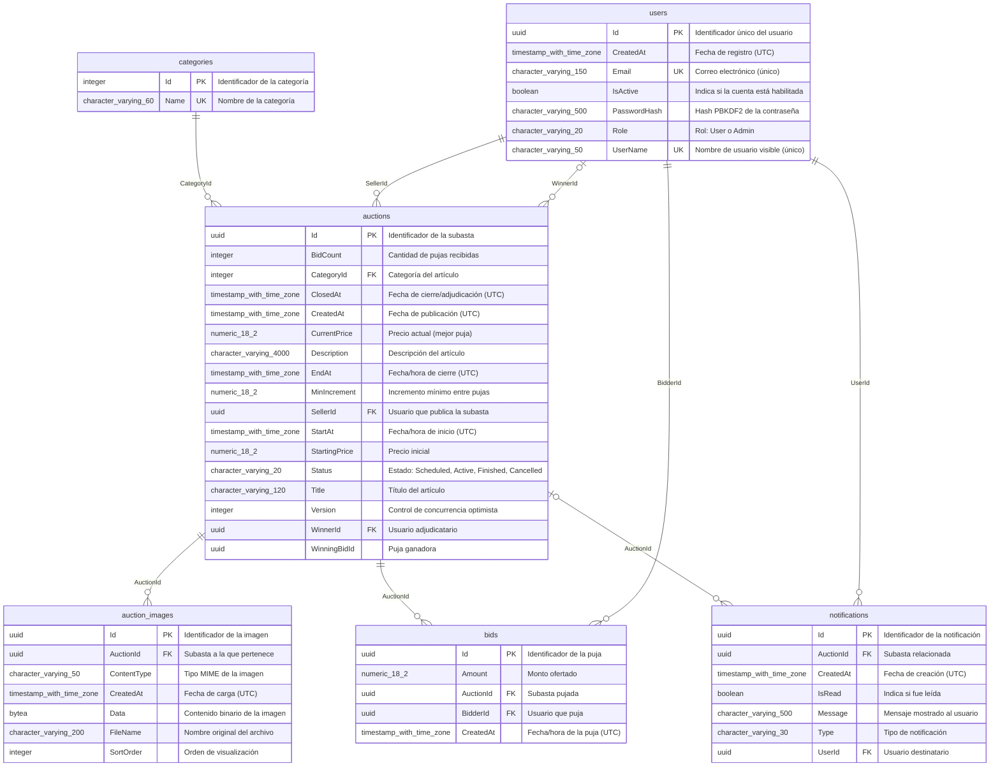

# Diagrama entidad-relación

> Fuente: Modelo EF Core (Npgsql).
>
> Documento generado automáticamente por `generase-documentation.yml` (Subasta.DocGen) el 2026-10-03 02:25 UTC. No editar manualmente.

