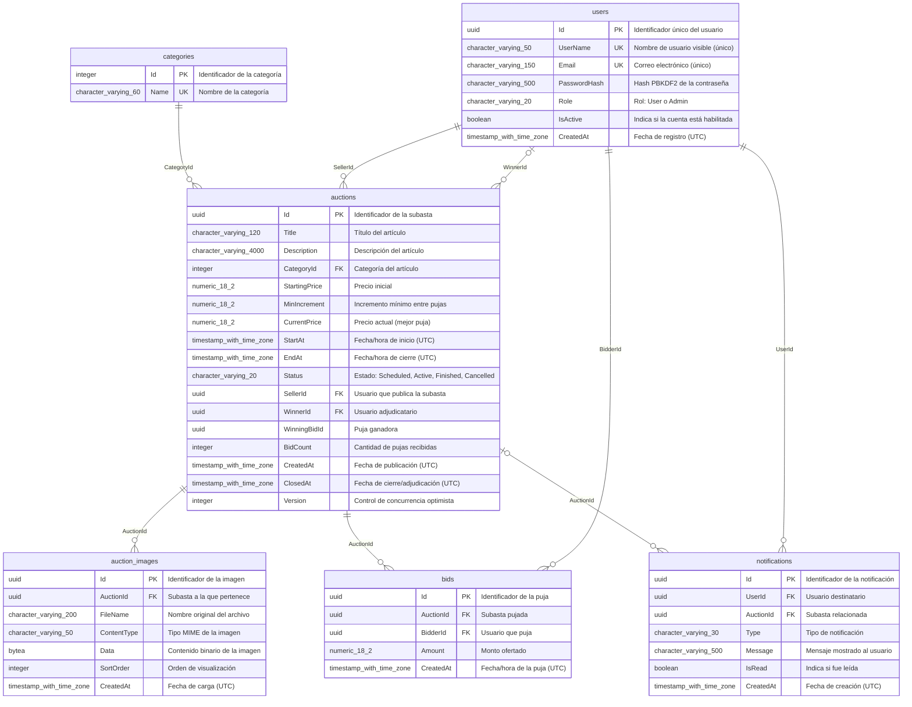

# Diagrama entidad-relación

> Fuente: Base de datos PostgreSQL `subasta` (esquema public).
>
> Documento generado automáticamente por `generase-documentation.yml` (Subasta.DocGen) el 2026-10-03 02:26 UTC. No editar manualmente.

